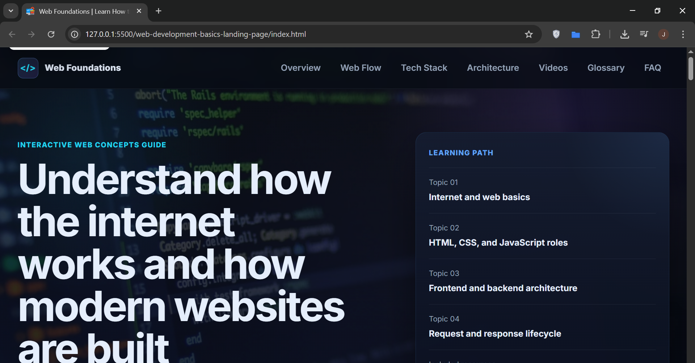

# Web Foundations

A dark-themed educational landing page designed to explain how the internet works and introduce the core concepts of web development in a clear, structured, and visually engaging way.

This project was built as a project with special attention to semantic HTML, accessibility, responsive design, maintainable CSS architecture, and polished UI interactions.

---

## Overview

**Web Foundations** is an educational single-page website created to help beginners understand the relationship between the internet, browsers, servers, and modern frontend technologies such as HTML, CSS, and JavaScript.

The project combines a technical visual identity with beginner-friendly explanations and a structured content flow. Its purpose is not only to present information, but also to demonstrate a professional frontend implementation with strong design consistency and user experience considerations.

---

## Live Demo

**Demo:** [https://jandresdevelop.github.io/Web-development-basics-landing-page/](https://jandresdevelop.github.io/Web-development-basics-landing-page/)

---

## Repository

**Repository:** [https://github.com/jandresdevelop/Web-development-basics-landing-page](https://github.com/jandresdevelop/Web-development-basics-landing-page)

---

## Features

- Premium dark-tech visual design
- Responsive layout for desktop, tablet, and mobile devices
- Semantic HTML structure
- Sticky navigation bar
- Mobile navigation with accessible toggle behavior
- Active navigation link based on visible section
- Scroll progress indicator
- Reveal-on-scroll animations
- Beginner-friendly educational content structure
- Embedded video lessons
- Technical glossary section
- FAQ using semantic `details` and `summary`
- Accessible focus states and skip link
- SEO-friendly metadata structure
- JSON-LD structured data for educational content

---

## Tech Stack

- **HTML5**
- **CSS3**
- **JavaScript (Vanilla JS)**

No frontend frameworks or third-party UI libraries were used.

---

## Project Structure

```bash
Web-Foundations/
│
├── index.html
├── README.md
│
├── css/
│   └── styles.css
│
├── js/
│   └── script.js
│
└── assets/
    ├── favi.ico
    ├── images/
    │   ├── hero-network.webp
    │   └── preview-cover.png
    └── icons/
        ├── html-icon.svg
        ├── css-icon.svg
        └── js-icon.svg
```

## Design and Development Goals

This project was improved with the intention of reaching a **portfolio premium** standard appropriate for a **semi-senior or senior-style frontend presentation**.

Key goals included:

- creating a strong and consistent technical visual identity
- improving perceived product quality
- making the learning experience feel more structured and intentional
- reinforcing accessibility and semantic HTML usage
- building a codebase that remains clean, readable, and maintainable

---

## Accessibility Considerations

Accessibility was considered throughout the project, including:

- semantic landmarks (`header`, `main`, `section`, `footer`, `nav`)
- skip link for keyboard users
- visible `:focus-visible` states
- accessible mobile navigation with `aria-expanded` and `aria-controls`
- keyboard support for closing the menu with `Escape`
- `aria-labelledby` usage for section relationships
- meaningful alt handling for informative and decorative images
- support for reduced motion through `prefers-reduced-motion`

---

## SEO Considerations

The project includes foundational SEO improvements such as:

- descriptive page title
- meta description
- Open Graph metadata
- Twitter card metadata
- canonical URL
- theme color
- structured data using JSON-LD (`EducationalWebPage`)

---

## JavaScript Functionality

The JavaScript layer is organized by responsibility and includes:

- mobile navigation behavior
- closing the mobile menu on outside click
- sticky header scroll state
- active navigation link tracking based on visible section
- scroll progress bar updates
- reveal-on-scroll animation logic
- reduced-motion-aware behavior

---

## Performance Notes

Some performance-conscious choices included:

- `.webp` image usage for the hero image
- lazy loading on embedded videos where applicable
- lightweight JavaScript without external dependencies
- CSS transitions designed to remain subtle and efficient
- reduced-motion handling for motion-sensitive users

Further production optimizations could include:

- self-hosted fonts
- AVIF image formats
- asset compression and minification
- replacing embedded iframes with thumbnail-based lazy video loading
- advanced caching and CDN delivery strategies

---

## Educational Content Sections

The landing page is organized around a progressive educational structure:

- **Overview** — what the internet enables
- **Web Flow** — what happens when a website is opened
- **Tech Stack** — HTML, CSS, and JavaScript roles
- **Architecture** — frontend vs backend responsibilities
- **Video Lessons** — short learning resources
- **Glossary** — essential technical definitions
- **FAQ** — common beginner questions
- **Final CTA** — encourages deeper learning progression

This structure was intentionally designed to make the content easier to scan, understand, and revisit.

---

## How to Run Locally

Because this is a static frontend project, you can run it locally very easily.

### Option 1: Open directly

Open `index.html` in your browser.

### Option 2: Use a local server

Using VS Code with Live Server is recommended.

#### Example

1. Clone the repository
2. Open the project folder in VS Code
3. Run it using Live Server

---

## Installation

```bash
git clone https://github.com/your-username/web-foundations.git
cd web-foundations
```

## Author

Jose Andres Hernandez

- GitHub: [https://github.com/jandresdevelop](https://github.com/jandresdevelop)
- Email: [jandresdevelop@gmail.com](jandresdevelop@gmail.com)

## License

This project is intended for educational and portfolio purposes.

If you want to publish it as an open-source project, you can use the MIT License.

## Preview



## Final Note

Web Foundations was designed as more than a simple informational page.
It was built as a frontend portfolio project that combines technical content, visual consistency, accessibility, and polished interaction patterns to reflect a stronger and more professional development approach.
